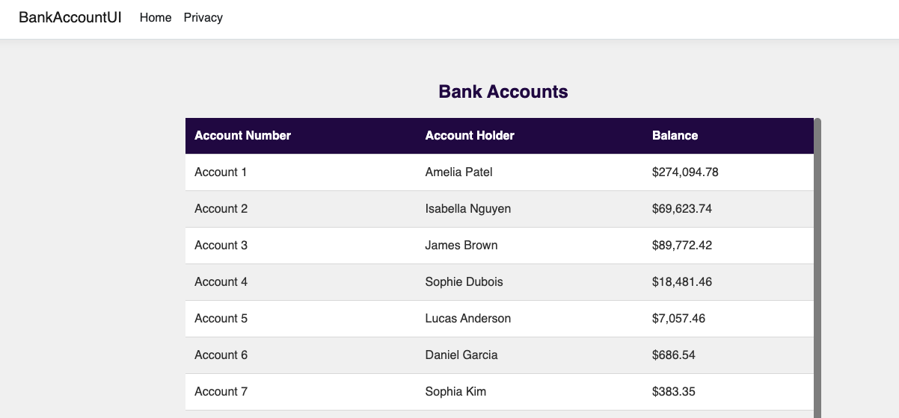

# Bank Account Solution

This solution contains a simple Bank Account MVC project with a REST API, a front-end built with Razor Pages, and accompanying unit tests.

## Project Overview

### BankAccountAPI
- **Controllers**: Contains the `BankAccountController` which handles HTTP requests related to bank accounts.
- **Models**: Defines the `BankAccount` class representing a bank account with properties like `Id`, `AccountNumber`, `AccountHolderName`, and `Balance`.
- **Services**: Implements the `BankAccountService` class that provides business logic for managing bank accounts.

### BankAccountUI (Front-End)
- **Razor Pages**: Implements a simple front-end for viewing bank accounts.
- **Integration**: Fetches data from the `BankAccountAPI` using HTTP client services.

### BankAccountAPI.Tests
- **Controllers**: Contains unit tests for the `BankAccountController` to ensure correct handling of HTTP requests.
- **Services**: Contains unit tests for the `BankAccountService` to verify business logic and data manipulation.
- **End-to-End Tests**: Contains end-to-end tests to verify the complete workflow of the application.

### BankAccountUI.Tests (UI Testing)
- **Selenium WebDriver**: Automates UI interactions to validate front-end functionality.
- **ChromeDriver**: Enables automated testing in Google Chrome.
- **NUnit Framework**: Provides test structure and assertions.

## Setup Instructions

1. Clone the repository:
   ```sh
   git clone <repository-url>
   ```

2. Navigate to the solution directory:
   ```sh
   cd BankAccountSolution
   ```

3. Restore the dependencies:
   ```sh
   dotnet restore
   ```

4. Run the API:
   ```sh
   dotnet run --project BankAccountAPI
   ```

5. Run the front-end:
   ```sh
   dotnet run --project BankAccountUI
   ```

6. Open the browser and navigate to:
   ```
   http://localhost:5074/
   ```
   This will display the Bank Account UI.
   

7. Run the API and unit tests from the project root directory:
   ```sh
   dotnet test BankAccountAPI.Tests
   ```

8. Run the UI tests:
   ```sh
   dotnet test BankAccountUI.Tests
   ```

## Running Tests Separately

### API Tests
1. Open a terminal and navigate to the `BankAccountAPI.Tests` directory.
2. Run the following command to execute the tests:
   ```sh
   dotnet test
   ```

### UI Tests with Selenium:
1. Ensure **Google Chrome** is installed on your system.
2. Open a terminal and navigate to `BankAccountUI.Tests`.
3. Run:
   ```sh
   dotnet test
   ```
   This will launch **Chrome**, navigate to the Bank Accounts page, and verify the UI.

## Dependencies

This project may require the following NuGet packages for testing:

- `NUnit`: A popular testing framework for .NET.
- `Moq`: A library for creating mock objects in unit tests.
- `Selenium.WebDriver`: Provides automation for web UI testing.
- `Selenium.WebDriver.ChromeDriver`: Enables Chrome browser automation.

Make sure to restore the packages by running:
```sh
   dotnet restore
```

## Recursive Self-Improvement Prompting
Create a statistical analysis api for the bank. Follow this process:
Generate an initial version of create a statistical analysis api for the bank
Critically evaluate your own output, identifying at least 3 specific weaknesses
Create an improved version addressing those weaknesses
Repeat steps 2-3 two more times, with each iteration focusing on different aspects for improvement
Present your final, most refined version as well as a journal of output from each stage

## Context Aware Decomposition
The bank would like to now offer loans to account holders.  These are separate accounts from savings and the bank will charge a configurable interest rate per loan
Please help me by:
Identifying the core components of this problem (minimum 3, maximum 5)
For each component:
Explain why it's important to the overall problem.
Identify what information or approach is needed to address it
Solve that specific component
After addressing each component separately, synthesize these partial solutions, explicitly addressing how they interact
Provide a holistic solution that maintains awareness of all the components and their relationships
Throughout this process, maintain a "thinking journal" that explains your reasoning at each step.

## Chain of Thought Prompting
Q: The bank pays 2% interest on balances over $1000, but only 1% on balances from $0-1000.  How much interest is paid on a balance of $1500
A: The bank pays $20 interest
Q: The bank will only pay interest on a single account - the account with the largest balance.  If John has one account with a balance of $1000 and another of $500, how much interest will John earn.
A:  John will earn $10 interest from the account with $1000 and $0 interest from the account with $500
Write a method to calculate the interest an account holder will earn.  Follow the examples above and think step by step.  Show the account holders and their interest payments 

## Production Readiness Skill Prompt content - copy everything between the >>>>>> delimiters.
>>>>>>
---
name: prod-readiness-check
description: Audits code against enterprise production standards for observability, resilience, and security.
---

# Production Readiness Auditor
When this skill is activated, evaluate the provided code against these 3 pillars:

### 1. Observability
* Check for meaningful logging (not just `console.log`).
* Ensure error handling prevents silent failures.

### 2. Resilience
* Look for timeouts, retries, or circuit breakers on all external network calls or database queries.

### 3. Security
* Flag any hardcoded secrets, API keys, or credentials.
* Check for missing input validation or sanitization.

## Output Requirement
Provide a clear **"Go/No-Go"** summary at the top, followed by a bulleted list of **"Required Fixes."**
>>>>>>

## Spec-kit Commands
- /speckit.constitution [prompt] : Generates or updates the constitution.md file. It establishes the "governing principles" of the project, 
- /speckit.specify [prompt] : Generates the Functional Specification. It takes a user's high-level intent and converts it into detailed user stories and requirements.
- /speckit.clarify [prompt] : Identify and resolve ambiguities in the spec (optional)
- /speckit.plan [prompt] : Creates a Technical Implementation Plan. It reads the spec and constitution to set technology stack and architecture.
- /speckit.tasks [prompt] : Converts the technical plan into a checklist of actionable coding tasks.
- /speckit.analyze [prompt] : Validate your plan (optional)
- /speckit.implement [prompt] : Execute the tasks and produce the feature code


## Technologies Used
- .NET 8 (or later)
- ASP.NET Core MVC
- ASP.NET Core Razor Pages
- Entity Framework Core 
- NUnit (for testing)
- Moq (for mocking dependencies in tests)
- Selenium WebDriver (for UI testing)

## Contributing
Feel free to submit issues or pull requests for improvements or bug fixes.

